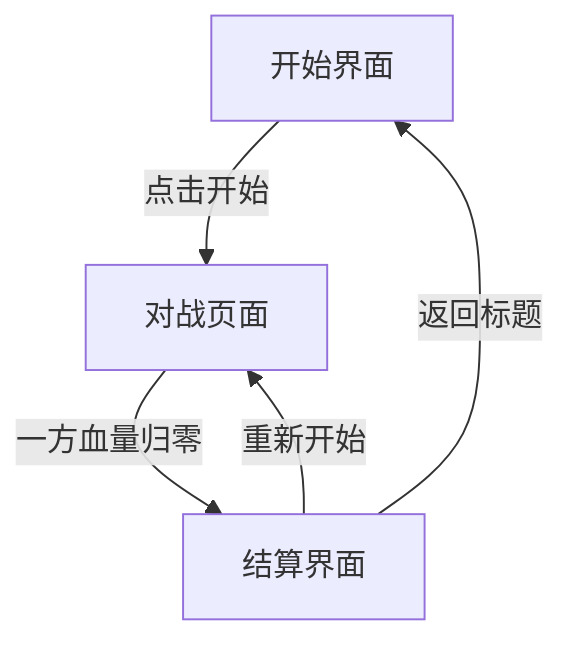

## 1. 产品概述

像素风机甲对战小游戏是一款复古像素风格的双人本地对战游戏。两名玩家各操控一台机甲，通过移动、攻击、防御等操作进行实时对战，先击败对方机甲者获胜。

- 目标用户：喜欢复古像素风、休闲对战的玩家
- 核心价值：简单易上手、节奏紧凑、视觉风格鲜明

## 2. 核心功能

### 2.1 玩家角色

| 角色 | 操控方式 | 特点 |
|------|----------|------|
| 玩家1（蓝方机甲） | WASD移动 / J攻击 / K防御 | 均衡型 |
| 玩家2（红方机甲） | 方向键移动 / L攻击 / ;防御 | 均衡型 |

### 2.2 功能模块

1. **对战页面**：游戏主画面，包含场景、角色、血量条、操作提示
2. **开始界面**：游戏标题、开始按钮、操作说明
3. **结算界面**：胜负结果、重新开始按钮

### 2.3 页面详情

| 页面名称 | 模块名称 | 功能描述 |
|----------|----------|----------|
| 开始界面 | 标题区域 | 像素风格游戏标题动画 |
| 开始界面 | 操作说明 | 双方操控键位展示 |
| 开始界面 | 开始按钮 | 点击或按空格开始游戏 |
| 对战页面 | 战斗场景 | 像素风城市废墟背景，地面平台 |
| 对战页面 | 蓝方机甲 | 像素机甲角色，支持移动/攻击/防御动画 |
| 对战页面 | 红方机甲 | 像素机甲角色，支持移动/攻击/防御动画 |
| 对战页面 | 血量条 | 双方血量实时显示，受击闪烁 |
| 对战页面 | 特效层 | 攻击火花、防御光盾、受击震屏 |
| 结算界面 | 胜负展示 | 显示获胜方，胜利动画 |
| 结算界面 | 重新开始 | 按钮或按键重新开始 |

## 3. 核心流程

1. 玩家进入开始界面，查看操作说明后点击开始
2. 双方机甲出现在场景两侧，对战开始
3. 玩家操控机甲移动、攻击、防御进行对战
4. 一方血量归零时，对战结束，进入结算界面
5. 玩家可选择重新开始或返回开始界面

### 3.1 战斗机制

- **移动**：左右移动，有加速度和惯性
- **攻击**：近身拳击攻击，有攻击前摇和后摇，攻击范围约1个身位
- **防御**：举起护盾，防御期间受到伤害减半，但无法移动
- **受击**：被攻击时短暂硬直，有击退效果
- **血量**：每方100点HP，攻击造成10点伤害（防御时5点）
- **胜负**：一方HP归零即判负

## 4. 用户界面设计

### 4.1 设计风格

- **主色调**：深蓝黑底色（#0a0a1a），搭配霓虹蓝（#00d4ff）和霓虹红（#ff3366）作为双方标识色
- **辅助色**：像素黄（#ffd700）用于UI高亮，暗灰（#2a2a3a）用于面板背景
- **按钮风格**：像素风3D凸起按钮，带阴影和按压效果
- **字体**：像素风字体（Press Start 2P），标题16px，正文8px
- **布局风格**：全屏Canvas游戏画面，顶部血量条HUD
- **图标风格**：8-bit像素图标，无圆角

### 4.2 页面设计概览

| 页面名称 | 模块名称 | UI元素 |
|----------|----------|--------|
| 开始界面 | 标题区域 | 像素风大标题，霓虹发光效果，缓慢浮动动画 |
| 开始界面 | 操作说明 | 像素风面板，键位图标+文字说明 |
| 开始界面 | 开始按钮 | 大号像素按钮，闪烁提示 |
| 对战页面 | 战斗场景 | 全屏Canvas，像素风城市废墟背景 |
| 对战页面 | 血量条 | 顶部两侧，像素风HP条，颜色随血量变化 |
| 对战页面 | 机甲角色 | 32x32像素精灵，多帧动画 |
| 对战页面 | 特效 | 攻击火花粒子、防御光圈、受击闪白 |
| 结算界面 | 胜负展示 | 大号像素文字，胜方颜色高亮 |
| 结算界面 | 重新开始 | 像素风按钮 |

### 4.3 响应式

- 桌面优先设计，Canvas自适应窗口大小
- 保持像素比例不变形，使用整数倍缩放
- 最小分辨率 800x600

## 5. 素材方案

### 5.1 像素精灵

所有角色和场景素材使用Canvas程序化绘制，无需外部图片资源：

- **蓝方机甲**：32x48像素，4帧行走动画、2帧攻击动画、1帧防御动画、1帧受击动画
- **红方机甲**：同上，换色版本
- **背景**：程序化绘制的像素城市废墟，包含建筑物剪影和星空

### 5.2 特效素材

- 攻击火花：程序化粒子系统
- 防御光盾：半透明像素圆环
- 受击震屏：画面偏移+闪白
