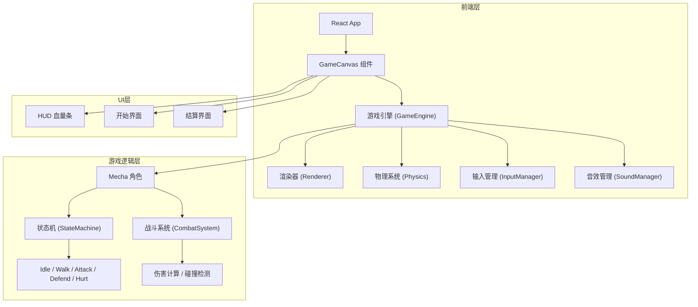
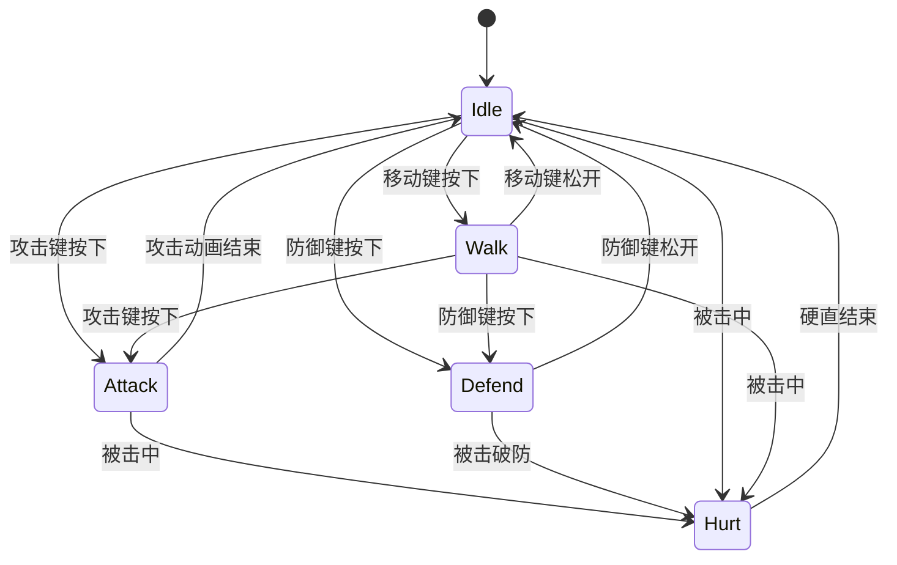

## 1. 架构设计



## 2. 技术说明

- **前端框架**：React@18 + TypeScript + Vite
- **样式方案**：Tailwind CSS@3
- **状态管理**：Zustand
- **游戏渲染**：HTML5 Canvas 2D（程序化像素绘制）
- **动画方案**：requestAnimationFrame 游戏循环
- **后端**：无（纯前端项目）
- **数据库**：无

## 3. 路由定义

| 路由 | 用途 |
|------|------|
| / | 游戏主页面（包含开始、对战、结算三个状态） |

## 4. 核心代码结构

```
src/
├── components/
│   ├── GameCanvas.tsx       # Canvas 游戏画布组件
│   ├── HUD.tsx              # 血量条等UI覆盖层
│   ├── StartScreen.tsx      # 开始界面
│   └── ResultScreen.tsx     # 结算界面
├── game/
│   ├── GameEngine.ts        # 游戏主循环与状态管理
│   ├── Renderer.ts          # 像素风渲染器
│   ├── InputManager.ts      # 键盘输入管理
│   ├── Physics.ts           # 简单物理（碰撞、击退）
│   ├── CombatSystem.ts      # 战斗系统（伤害计算）
│   ├── Mecha.ts             # 机甲角色类
│   ├── SpriteSheet.ts       # 像素精灵绘制
│   ├── ParticleSystem.ts    # 粒子特效系统
│   └── Scene.ts             # 场景绘制（背景）
├── store/
│   └── gameStore.ts         # Zustand 游戏状态
├── pages/
│   └── GamePage.tsx         # 游戏主页面
├── App.tsx
└── main.tsx
```

## 5. 游戏引擎核心设计

### 5.1 游戏循环

```
GameEngine.loop():
  1. InputManager.processInput()
  2. 更新机甲状态 (Mecha.update)
  3. CombatSystem.checkHit()
  4. Physics.update()
  5. ParticleSystem.update()
  6. Renderer.draw()
  7. requestAnimationFrame(loop)
```

### 5.2 机甲状态机



### 5.3 战斗系统

- 攻击判定：攻击动画播放到关键帧时，检测攻击方前方矩形区域是否与对方碰撞盒重叠
- 伤害计算：基础伤害10点，防御状态减半为5点
- 击退效果：被击中时向后方位移一段距离
- 硬直时间：受击后0.3秒无法操作

### 5.4 像素渲染方案

- 所有精灵使用Canvas程序化绘制（fillRect逐像素）
- 游戏画面以低分辨率（如320x180）渲染，再放大到Canvas实际尺寸，实现像素风效果
- 使用 `imageSmoothingEnabled = false` 保持像素锐利
- 精灵动画通过帧计数器切换绘制函数实现

## 6. 数据模型

### 6.1 游戏状态（Zustand Store）

```typescript
interface GameState {
  gamePhase: 'title' | 'playing' | 'result'
  players: [PlayerState, PlayerState]
  winner: number | null
  startGame: () => void
  resetGame: () => void
  updatePlayer: (index: number, partial: Partial<PlayerState>) => void
  setWinner: (index: number) => void
}

interface PlayerState {
  hp: number
  maxHp: number
  x: number
  y: number
  facing: 'left' | 'right'
  state: 'idle' | 'walk' | 'attack' | 'defend' | 'hurt'
  stateTimer: number
}
```
